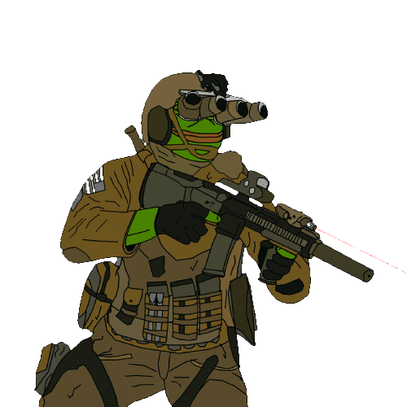

# NightVision Overlay Studio 

**Overlay Studio** is a training area for testing new overlays.

  

## Instalation 

1) Download the repo 
2) `npm install`
3) `npm run start`

## ⚠️ Warning ⚠️ 

This software is very experimental, bugs everywhere, be wary!

